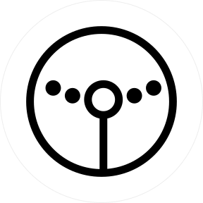
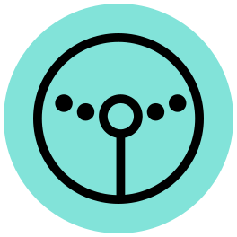

<p align="center">
   
</p>
<h3 align="center" style="margin-top: 0; padding-top: 0">
   Curio Parachain
</h3>
<p align="center">
   Substrate node of the Curio network
</p>

## 1. Introduction

This project is part of the CurioDAO ecosystem that extends CurioDAO's DeFi products in the field of real world asset tokenization on the [Polkadot](https://polkadot.network) network protocol.  

Curio Parachain is a network built on [Substrate](https://substrate.io) and includes native runtime modules to provide tokenization process of real world assets as fungible or non-fungible tokens and mechanisms for trading these assets. Parachain runtime supports certain types of assets and powers the following decentralized applications by CurioDAO: [Capital DEX](https://capitaldex.exchange), [Rollapp](https://rollapp.store), [Curio Stablecoin Protocol](https://curioinvest.com/curio-stablecoin).  

Curio Parachain uses [KILT's](https://www.kilt.io) dPoS consensus. Explore parachain-staking pallet doc [here](pallets/parachain-staking/README.md).

### Assets

The main and native token in the Curio Parachain is **Curio Governance Token (CGT)** which is used to pay transaction fees, to vote in on-chain governance, is used in dPoS staking, main utility token in CurioDAO’s products.

Curio Parachain will also use other tokens of CurioDAO ecosystem:
- **Curio Stable Coin (CSC)** - a stable coin (ERC-20) backed by tokenized real world assets in the [Curio Stablecoin Protocol](https://curioinvest.com/curio-stablecoin) on the Ethereum network. In the future, this token will be transferable between Ethereum and Curio Parachain;
- **Fungible Security Tokens** (like ERC-20 standard) backed by real world assets, such as Curio’s [CT1 token](https://etherscan.io/token/0x4F01887Cbd397a676921985639cEF79398204Cf0) backed by Ferrari F12tdf car;
- **Non-fungible Security Tokens** (like ERC-721 standard) backed by real world assets, such as [collection of wines](https://rollapp.store/collection/curio-wines/owned) tokenized by Curio;
- **Fractionalized Non-fungible Security Tokens** (like ERC-1155/ERC-1633 standard) backed by real world assets, such as [Mercedes-AMG GTS NFT](https://rollapp.store/token/0x6884eF328EA1862E69beD5aA30FfAfD4ed096Ce8:99326131137483886891004264430325786609158860882489678491178031342521990250497) by Curio;
- **Wrapped Security Tokens** associated to original Security Tokens (fungible, non-fungible and fractionalized), e.g. [wCT1 token](https://etherscan.io/token/0x46683747b55c4a0ff783b1a502ce682eb819eb75) by Curio.

The Curio Parachain will support other tokens, such as DOT and tokens from other projects in the Polkadot ecosystem.

---


> Development in progress

Capital DEX is an AMM-based DEX for trading crypto assets with the whitelist of traders and whitelist features of supported tokens, as well as a built-in farming mechanism for liquidity pools. Capital DEX's main focus is on trading Wrapped Security Tokens of real world assets (e.g. tokenized cars by CurioDAO or new tokenized users assets as a fungible tokens). Also on the Capital DEX will be available to trade other fundible tokens that are on Curio Parachain, such as CGT, DOT and others. AMM and farming mechanics similar to Capital DEX on the Ethereum network.

Capital DEX runs on Curio Parachain as a native runtime module consisting of a set of substrate pallets providing the following features:
- AMM and liquidity pools for tokens supported on Curio Parachain;
- Whitelist for supported tokens on Capital DEX;
- Wrapping mechanism for swap Fungible Security Tokens to Fungible Wrapped Security Tokens and back to enable trading of security tokens without KYC procedure for users;
- LP farming mechanism (logic similar to Capital DEX on the Ethereum network). Rewards token: CGT token or any other token on Curio Parachain;
- Swap using orderbook (will be developed in the future).

👉 *Visit the official website [capitaldex.exchange](https://capitaldex.exchange).*  
👉 *Visit the [Capital DEX analytics](https://info.capitaldex.exchange) application.*  
👉 *[DEX API docs](docs/DEX_API.md).*  

#### Pallets:

👉 *[DEX pallet](pallets/dex/README.md).*  
👉 *[Currencies pallet](pallets/currencies/README.md).*

---


> Development in progress

Rollapp is a platform for tokenization of real world assets as non-fungible and fractionalized tokens and a markeplace on Curio Parachain.

Rollapp has a set of modules for implementing the NFT trading logic (ERC-721, ERC-1155, ERC-1633 standards) and additional features such as royalties, NFT redeem logic. Real world assets tokenized as NFTs are trading on Rollapp: assets owned by CurioDAO (a user can buy and become the owner of an asset, and co-ownership of an asset - art, a car) and also users assets. Using Rollapp, any user can tokenize their physical goods - watches, collectible game cartridges, cars, art, music, real estate and others, and next sell it on Rollapp and others NFT markets. NFTs on Rollapp can be bought or sold for CGT tokens.

Assets such as wines, game cartridges, sneakers that CurioDAO has tokenized and put for sale can be redeemed as physical goods. This process requires the user to complete the KYC procedure (using [CurioInvest account](https://curioinvest.com/register)). In the future, a system (working like Escrow) will be developed where users will be able to sell their tokenized goods to other users as the sale of NFT and delivery of the physical goods.

👉 *Explore tokenized assets on [Rollapp](https://rollapp.store/explore).*  

Rollapp will run on Curio Parachain as a native runtime module consisting of a set of substrate pallets that provide the following functionality:
- main trading logic for NFT and trading orders: fixed price, timed auctions, unlimited auctions;
- royalties register logic, for the ability to set royalties when reselling NFTs;
- asset tokenization as NFT using Security NFTs and Wrapping modules;
- redeem functionality for NFTs that can be redeemed as physical goods.

👉 *Visit the official website [rollapp.store](https://rollapp.store).*  

#### Pallets:

👉 *[Common pallet](pallets/common/README.md).*  
👉 *[Re-Fungible pallet](pallets/refungible/README.md).*

---

<p>
   
   <span style="vertical-align: middle; font-size: 20px; font-weight: bold">
      Curio Stablecoin Protocol
   </span>
</p>

> Development in progress

Curio Stablecoin Protocol is a real world asset backed Curio stablecoin minting engine. This protocol works with real world assets that are used as collateral - collectible cars and other types of assets in the future.  

CurioDAO's selected cars prices sources are used as assets prices feed and used in Chainlink's oracles. The system is now running on Ethereum and with the first tokenized car - Ferrari F12tdf as a collateral - and planned to expand to Curio Parachain.  

Curio Stablecoin Protocol uses a DAO mechanism for its governance with the governance token CGT. The purpose of this governance for example: adding new types of collateral assets, setting the collateral assets' parameter.  

👉 *Find out more [here](https://curioinvest.com/curio-stablecoin).*  
👉 *Visit the [Curio Stablecoin Portal](https://stablecoin.curioinvest.com/borrow) and [Curio Governance Portal](https://vote-stablecoin.curioinvest.com).*

## 2. Install and Run
### 2.1. Get deb package
#### Requirements
You should firstly install packages with the following commands in terminal (with sudo-rights)
```bash
sudo apt-get update
sudo apt-get install dpkg-dev devscripts wget
```
#### Download and install
Download deb-package from [releases](https://gitlab.com/CurioTeam/curio-parachain/-/releases)
```bash
sudo dpkg -i curio_parachain_node_<version>_amd64.deb
```
### 2.2. Build from source
#### Rust Setup
First, complete the [basic Rust setup instructions](https://github.com/substrate-developer-hub/substrate-node-template/blob/main/docs/rust-setup.md).
#### Compile
To compile the curio-parachain-node:
1. Open a terminal shell on your computer.
2. Clone the curio-parachain-node repository by running the following command:
    ```bash
    git clone https://gitlab.com/CurioTeam/curio-parachain
    ```
3. Change to the root of the curio-parachain-node directory by running the following command:
    ```bash
    cd curio-parachain
    ```
4. Compile the curio-parachain-node by running the following command:
    ```bash
    cargo build --release
    ```
## 3. Run local testnet
### 3.1. Deb-package
1. First, you need to start relaychain. You can see about it [here](https://docs.substrate.io/tutorials/connect-other-chains/prepare-a-local-relay-chain/).
2. After that you should register parachain. Read about it [here](https://docs.substrate.io/tutorials/connect-other-chains/connect-a-local-parachain/).
3. Finally, you should start a parachain node that you are installing before
```bash
curio-parachain-node \
--alice \
--collator \
--force-authoring \
--chain <path-to-parachain-raw-spec>.json \
--base-path /tmp/parachain/alice \
--port 40333 \
--ws-port 8844 \
-- \
--execution wasm \
# $polkadot is the path, there you have installed polkadot
--chain $polkadot/raw-local-chainspec.json \
--port 30343 \
--ws-port 9977
```
### 3.2. Builded from source
First two steps will be similar to `3.1. Deb-package`
Last step, change to the root of the curio-parachain-node directory
```bash
# $PATH is the root path of the curio-parachain-node
cd $PATH/curio-rapachain-node
```
and then you can start a parachain node with
```bash
./target/release/curio-parachain-node \
--alice \
--collator \
--force-authoring \
--chain <path-to-parachain-raw-spec>.json \
--base-path /tmp/parachain/alice \
--port 40333 \
--ws-port 8844 \
-- \
--execution wasm \
# $polkadot is the path, there you have installed polkadot
--chain $polkadot/raw-local-chainspec.json \
--port 30343 \
--ws-port 9977
```
### 3.3. With polkadot-launch
How to install `polkadot-launch` you can search [here](https://github.com/paritytech/polkadot-launch).

After that to start local testnet you should:
1. Open a terminal shell on your computer.
2. Change to the root of the curio-parachain-node directory by running the following command:
    ```bash
    # $PATH is the root path of the curio-parachain-node
    cd $PATH/curio-parachain
    ```
3. Copy curio related launch json to polkadot-launch by running the following command:
    ```bash
    # $polkadot-launch is the home of polkadot-launch
    cp polkadot-launch/*.json $polkadot-launch/
    ```
4. Build relaychain by running the following command:
    ```bash
    # <version> of polkadot should be similar to version
    cargo install --git https://github.com/paritytech/polkadot --tag <version> polkadot --locked
    ```
5. Build parachain node by running the following command:
    ```bash
    cargo build --release
    ```
6. Launch polkadot and parachain with json config file in polkadot-launch by running the following command:
    ```bash
    polkadot-launch curio-launch.json
    ```

## License

[GPL-3.0](LICENSE)